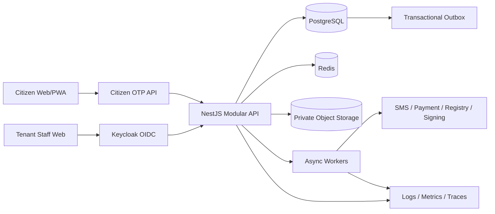

# ServiceFormAI OS: Implementation Reset Plan 2026

**Status:** Canonical execution plan with agent-maintained task register
**Planning horizon:** 16 weeks
**Primary objective:** Prove a production-grade, tenant-isolated government service transaction from citizen onboarding through issued output, then qualify a staged path to the nationally scaled 10,000-TPS target.

## 1. Document Authority

When requirements conflict, use this order:

1. Decisions recorded in this plan.
2. `Government_Service_OS_Production_Engineering_Blueprint_v3_World_Class.docx` for target architecture and sequencing.
3. `Government_Service_OS_Production_Engineering_Blueprint_v2.docx` for engineering detail where v3 is silent.
4. `Government_Service_OS_Master_BRD_Architecture_AI_Specification_v1.docx` for business requirements and traceability.
5. `Government_Service_OS_Global_Feature_Benchmark_Report_2026.docx` as advisory benchmark input, not implementation evidence.
6. Sections 15-17 of this plan govern the 10,000-TPS capacity target and the current AI-agent status ledger; older 1,000-TPS audit prompts are advisory and do not qualify as capacity evidence.

The two Master BRD v1 files contain equivalent business content. Keep the filename without `(1)` as the canonical source and archive the duplicate.

This plan supersedes `vol 19_implementation_backlog.md` and `vol 21_sprint_execution_plan.md` wherever they prioritize DigiLocker login, recommendations, AI, or broad feature expansion ahead of identity, transaction integrity, and end-to-end delivery.

## 2. Decisions Fixed for MVP

1. Citizens onboard and sign in using mobile OTP.
2. Citizens do not use Keycloak.
3. DigiLocker is a post-MVP citizen account-link and evidence-source integration.
4. Tenant administrators, officers, clerks, and reviewers authenticate through Keycloak. Platform-operator identity is a separate decision and is not included in tenant-staff Keycloak mapping.
5. Every government body is an independent tenant. Ministry, state, district, municipality, panchayat, ward, and village are governance metadata and authorization attributes, not nested tenants.
6. The MVP must complete forms and pass real end-to-end tests.
7. Preserve the current React/Vite, NestJS, TypeORM, PostgreSQL, Redis, object-storage, and worker foundation. Technology replacement requires an ADR and measured justification.
8. Statutory eligibility and decisions remain deterministic and human-governed. AI cannot publish or make final statutory decisions.

## 3. Current-State Verdict

**Snapshot note:** This section records the original reset-plan baseline. For verified repository and deployment status after that baseline, use the dated snapshot in Section 17 and the task register in Section 16.

The repository is a credible prototype and backend foundation, but not yet a production MVP.

### Working foundations

- Tenant-scoped producer queries and cross-tenant integration tests.
- Dynamic form, validation, and service-manifest packages.
- Application submission, status history, deficiency handling, consent, payment, upload, queue, audit, and integration modules.
- React citizen, officer, tenant, operations, and public surfaces.
- PostgreSQL migrations, Redis fallback behavior, object-storage integration, workers, deployment assets, and health endpoints.

### Production blockers

- Citizen OTP is simulated in the browser and accepts a fixed test code.
- Tenant staff still use local passwords instead of Keycloak.
- Tenant onboarding does not transactionally create the tenant, governance scope, initial membership, and provisioning request.
- Published services are mutable and applications do not retain complete immutable service, form, rule, workflow, and policy versions.
- Workflow transitions accept weakly governed status changes and are not transactionally tied to event, audit, and outbox records.
- The main citizen form journey does not consistently use the shared form engine as the authoritative renderer and validator.
- Browser journeys rely heavily on redirects or mocks rather than a real frontend/backend/database stack.
- Evidence is still treated mainly as files rather than reusable assertions with provenance, assurance, freshness, purpose, and consent.
- Observability, disaster recovery, accessibility evidence, and release gates are incomplete.

## 4. Change of Action

### Stop

- Adding more showcase screens before completing the transaction spine.
- Treating DigiLocker as the MVP citizen login authority.
- Creating local passwords for tenant staff.
- Modeling government hierarchy as parent-child tenants.
- Expanding the number of shallow service templates.
- Prioritizing recommendation feeds, AI Composer, process mining, digital twins, or advanced analytics before the first production service works.
- Claiming production readiness from documentation, mocked API tests, or redirect-only browser tests.
- Introducing Kafka, Camunda, OpenSearch, Flutter, or microservices without a measured need or procurement requirement.

### Start

- Real citizen mobile OTP issue, verify, enrollment, login, and session flows.
- Keycloak OIDC for all tenant staff with explicit tenant memberships and role mapping.
- Immutable service releases and application snapshots.
- A transactional case-transition command that writes state, actor, event, audit, and outbox together.
- A complete Income Certificate reference service before adding more service families.
- Full-system Playwright tests against real services and controlled provider doubles.
- Blocking security, tenant-isolation, accessibility, migration, and restore gates.

### Continue

- The NestJS modular monolith and TypeORM migrations.
- Existing tenant-scoped repository conventions.
- Existing form-engine, validation-engine, and service-manifest packages.
- Existing consent, payment, upload, queue, audit, deficiency, and application-history work.
- Configuration-driven services and separately scalable workers.

## 5. Target MVP Architecture

### Identity boundaries

- **Citizen identity:** normalized E.164 mobile number, OTP challenge, citizen record, and platform-issued citizen session.
- **Staff identity:** validated Keycloak issuer, audience, signature, expiry, and subject.
- **Staff authorization:** Keycloak subject resolves to one or more explicit tenant memberships. Every request executes under one validated tenant context.
- **Platform-operator identity:** keep logically separate from tenant staff. Define its identity provider, step-up authentication, emergency access, and cross-tenant audit controls in an ADR before implementation.
- **Role model:** deny-by-default permissions for platform admin, tenant admin, officer, clerk, reviewer, and citizen. Add jurisdiction, office, service, case stage, and delegated-authority attributes where needed.
- **DigiLocker later:** link to an existing citizen as an external identity and evidence provider. Never make it the tenant or citizen system of record.

### Tenant boundary

- One tenant per onboarded government body.
- Governance hierarchy is structured tenant and service metadata backed by LGD reference data.
- Every tenant-owned database record, cache key, object key, event envelope, search projection, and audit record carries trusted tenant context.
- Client-provided tenant identifiers are never accepted as authority.

## 6. Delivery Sequence

### Phase 0: Baseline and Decisions, Weeks 1-2

**Outcomes**

- Freeze the MVP scope and establish executable baselines.
- Approve the ADRs listed in section 12.
- Correct documentation that overstates production readiness.
- Make full-stack E2E capable of running in CI with controlled provider doubles.

**Work**

- Record current frontend, backend, package, migration, integration, and Playwright results.
- Define canonical API error, pagination, idempotency, correlation, and event envelopes.
- Create test fixtures for two tenants, citizen identities, staff memberships, and provider doubles.
- Make critical E2E tests blocking rather than advisory.
- Define the Income Certificate policy source, form, evidence, rules, workflow, outputs, and acceptance journey.
- Approve the field-type inventory, per-service branch matrices, pilot load profile, failure profile, and exception process defined in section 8.

**Primary touchpoints**

- `package.json`
- `backend/package.json`
- `playwright.config.ts`
- `.github/workflows/*`
- `BUILD_AND_TEST.md`
- `volume_03_system_design_specification.md`

**Exit gate**

- Baseline report exists, ADRs are approved, and CI can start the real test stack.

### Phase 1: Identity, Tenant Provisioning, and Authorization, Weeks 3-4

**Citizen OTP**

- Add `OtpChallenge`, provider adapter, OTP issue, verify, resend, and session endpoints.
- Hash OTP values and enforce short expiry, one-time atomic consumption, attempt limits, resend cooldown, and mobile/IP/device velocity controls.
- Use generic responses to prevent account enumeration.
- Replace the fixed frontend OTP and password fallback with backend OTP APIs.
- Auto-create or resolve the citizen after successful verification.

**Staff Keycloak**

- Add OIDC/JWKS token validation for tenant staff.
- Map Keycloak subject to `StaffIdentity` and `TenantMembership`.
- Resolve tenant, role, office, jurisdiction, and delegated authority server-side.
- Remove local staff password issuance after a compatibility window.

**Platform operators**

- Keep cross-tenant operator endpoints disabled until the platform-operator ADR is approved and implemented.
- Never represent a platform operator as a synthetic tenant membership.
- When enabled, require the separately approved identity path, step-up authentication for privileged actions, explicit scope and purpose, and append-only cross-tenant audit evidence.

**Tenant onboarding**

- Create a real onboarding endpoint that transactionally creates tenant, governance scope, initial staff membership invitation, and provisioning status.
- Keep state, district, municipality, and other hierarchy fields as governance metadata.

**Primary touchpoints**

- `backend/src/auth/*`
- `backend/src/tenant/*`
- `backend/src/database/entities/*`
- `src/app/pages/Login.tsx`
- `src/app/pages/TenantOnboarding.tsx`
- `src/app/services/api/auth.service.ts`

**Exit gate**

- Every citizen session originates from a consumed OTP challenge.
- Every tenant-staff request resolves a Keycloak subject, tenant membership, and allowed role.
- No platform-operator credential is accepted by the tenant-staff authentication path; enabled operator actions pass separate identity, step-up, scope, and audit tests.
- Cross-tenant and cross-role authorization tests pass.

### Phase 2: Immutable Service Runtime and Forms, Weeks 5-6

**Data model**

- Add `ServiceTemplate`, `ServiceVersion`, `FormVersion`, `RuleSetVersion`, `WorkflowVersion`, `PolicySource`, and `TraceLink`.
- A published release is immutable. Editing creates a new draft/version.
- Add `ApplicationSnapshot` references for exact form, rule, workflow, policy, and service versions.
- Add optimistic concurrency to drafts and configuration edits.

**Forms**

- Make the shared form engine the authoritative frontend renderer and validation engine.
- Support sections, conditional fields, repeatable groups, attachments, declarations, accessibility metadata, and multilingual labels.
- Add durable server-side draft save/resume with schema-version conflict handling.

**Tenant service lifecycle**

- Let a tenant administrator discover and clone an approved template into a tenant-owned draft.
- Support controlled customization within declared override boundaries.
- Validate form, rules, workflow, evidence, privacy, localization, and output contracts before publication.
- Run deterministic simulation fixtures and display the version diff.
- Require configurable maker-checker approval before immutable publication.
- Preserve template lineage, certification state, adopted version, and upgrade compatibility.

**Migration strategy**

1. Add new nullable version and snapshot tables.
2. Backfill one legacy version from each current tenant service.
3. Mark existing applications with explicit legacy snapshots and provenance.
4. Dual-write old and new representations.
5. Compare results and switch reads per tenant behind feature flags.
6. Remove mutable publication paths after one rollback-compatible release window.

**Primary touchpoints**

- `packages/service-manifest/*`
- `packages/form-engine-core/*`
- `packages/form-engine-react/*`
- `backend/src/producer/*`
- `backend/src/consumer/*`
- `backend/src/database/entities/*`
- `src/app/pages/ApplicationJourney.tsx`
- `src/app/pages/ServiceCreationWizard.tsx`
- `src/app/pages/ManifestStudio.tsx`

**Exit gate**

- Published releases cannot be mutated.
- Drafts survive logout/restart.
- Submitted applications retain exact immutable runtime versions.
- A tenant-admin Playwright journey completes template discovery, clone, customization, validation, simulation, approval, immutable publication, and citizen visibility.

### Phase 3: Income Certificate End to End, Weeks 7-10

Income Certificate is the first reference service because it exercises identity, residence, income evidence, deterministic eligibility, deficiency handling, officer review, and signed output without requiring payment or a complex civil registry.

**Citizen flow**

1. Mobile OTP onboarding/login.
2. Service discovery and tenant/jurisdiction resolution.
3. Consent and privacy notice.
4. Manifest-driven form completion.
5. Evidence upload and source/provenance capture.
6. Declaration and final review.
7. Idempotent submission and acknowledgement.
8. Status timeline and deficiency response.
9. Certificate retrieval and verification.

**Officer flow**

1. Keycloak login and tenant membership resolution.
2. Tenant-scoped queue and assignment.
3. Field and evidence verification.
4. Structured deficiency and citizen resubmission.
5. Deterministic rule result with human decision and reason.
6. Maker-checker approval where configured.
7. Certificate generation, signing adapter, notification, and audit completion.

**Case integrity**

- Replace direct status mutation with allowed transitions.
- In one transaction write application state, actor, decision reason, event, audit, and outbox record.
- Add SLA timers and escalation events.
- Bind idempotency to tenant, consumer, operation, and request hash.

**Redress and accountability**

- Add configurable grievance, appeal, and independent feedback records linked to the application and immutable decision version.
- Define eligibility windows, grounds, attachments, assignment, hearing/response, resolution, reopening, and citizen-visible timelines.
- Keep appeal review independent from the original decision maker where policy requires it.
- Define feedback categorization, assignment, response or disposition, closure, citizen notification, and timeline visibility independently from grievance and appeal decisions.

**Exit gate**

- A citizen completes OTP-to-certificate, including deficiency and resubmission, against the real backend and PostgreSQL.
- No critical path uses mocked frontend state.
- Full-system E2E journeys take a linked grievance and eligible appeal through assignment, independent review where required, response/hearing, resolution, citizen notification, timeline visibility, and permitted reopening. A separate feedback journey covers categorization, assignment, response or disposition, closure, citizen notification, and timeline visibility.

### Phase 4: Prove Reuse with Two More Services, Weeks 11-15

**Trade Licence, Weeks 11-13**

- Exercise fees, payment replay protection, geography routing, inspection, maker-checker approval, licence validity, renewal, and QR verification.
- Implement it as configuration and reusable capabilities, not service-name branches.

**Birth Certificate, Weeks 14-15**

- Exercise family/event data, registry adapter, delayed registration, correction/query workflow, evidence relationships, and certificate issuance.
- Use a controlled registry provider double until an approved external sandbox exists.

**Exit gate**

- All three services use the same form, workflow, evidence, case, output, notification, and audit runtime.
- At least 80% of each service is configuration and there are no service-name conditionals in shared runtime code.

### Phase 5: Production Evidence and Release, Week 16

- Rerun the security, accessibility, performance, resilience, migration, rollback, backup, and restore gates executed incrementally since Phase 1.
- Close blocking findings and complete operations dashboards, alerts, runbooks, and incident procedures.
- Produce a release evidence pack linking requirements to code, tests, results, and accepted exceptions.
- Pilot one tenant with explicit rollback and support ownership.

**Exit gate**

- All blocking gates pass, accepted exceptions have named owners and expiry dates, rollback and restore are demonstrated, and pilot authorization is signed off.

### Continuous assurance by phase

- Phase 1 blocks on identity threat tests, tenant and role isolation, OTP abuse controls, auditability, and authentication accessibility.
- Phase 2 blocks on schema migration and rollback, immutable-release authorization, form accessibility, and representative form-render performance.
- Phase 3 blocks on Income Certificate security, accessibility, load, provider-failure, worker-restart, and restore journeys.
- Phase 4 reruns those gates for payment, registry, signing, and the combined three-service load profile.
- Fix blocking defects in the phase that introduces them; do not defer remediation to Week 16.

## 7. Required Data Domains

### Add for MVP

- `CitizenIdentity`
- `OtpChallenge`
- `CitizenSession`
- `StaffIdentity`
- `TenantMembership`
- `ServiceTemplate`
- `ServiceVersion`
- `FormVersion`
- `RuleSetVersion`
- `WorkflowVersion`
- `PolicySource`
- `TraceLink`
- `ApplicationSnapshot`
- `DecisionTrace`
- `EvidenceArtifact`
- `CertificateArtifact`
- `GrievanceCase`
- `AppealCase`
- `CitizenFeedback`
- `IdempotencyRecord`
- `OutboxEvent`

### Strengthen existing domains

- Add database foreign keys and tenant-consistency constraints to applications and related records.
- Add selected PostgreSQL row-level security as defense in depth.
- Make audit evidence append-only and define retention, redaction, and privacy-erasure interaction.
- Record actor, tenant, correlation ID, causation ID, reason, and artifact hashes for material actions.
- Treat evidence as an assertion with source, subject, assurance, freshness, purpose, legal basis, consent, and usage history.

## 8. Testing Strategy and Blocking Gates

### Test pyramid

1. Package unit tests for manifests, forms, rules, transitions, and reference data.
2. React component tests for every supported field, conditional path, error, and recovery state.
3. NestJS use-case tests for identity, authorization, versioning, submission, transition, evidence, and output behavior.
4. Integration tests using real PostgreSQL, Redis, and object storage.
5. Provider contract tests for SMS, Keycloak, payment, registry, signing, and later DigiLocker adapters.
6. Full-system Playwright journeys against the real frontend and backend.
7. Accessibility, security, load, resilience, migration, rollback, and restore tests.

### Release blockers

- Three reference-service happy paths and the approved negative-journey matrices pass without skipped critical tests.
- Two-tenant IDOR tests pass across APIs, database, cache, objects, events, and staff memberships.
- OTP expiry, replay, brute-force, resend, provider-failure, and session-revocation tests pass.
- Tenant-staff tokens with the wrong tenant, role, audience, issuer, or expiry are rejected.
- Platform-operator credentials cannot enter tenant-staff routes or acquire synthetic tenant memberships.
- Every item in the approved field-type inventory and each branch in the per-service form matrix has an automated test or a time-bounded exception.
- The tenant-admin template-to-publish journey, citizen grievance, eligible appeal, and independent feedback journeys pass end to end.
- Retry of submission, payment, and certificate generation produces one durable outcome.
- WCAG 2.2 AA automated checks pass, followed by manual keyboard and screen-reader acceptance for critical journeys.
- No open critical/high security findings and no open P0/P1 functional defects.
- Forward migration, rollback, old-client compatibility, and backup restore are demonstrated.
- Accepted submissions have zero loss under the signed pilot load and failure profiles.

### Test evidence definitions

- Maintain a versioned field-type inventory listing renderer, validation, accessibility, persistence, migration, and E2E coverage for each supported type.
- Maintain one branch matrix per reference service covering conditional visibility, required evidence, validation failures, deficiency correction, decisions, and outputs.
- Give every branch and negative-journey row a stable ID, preconditions and inputs, expected API/UI result, persisted state, event/audit/outbox effects, recovery behavior, and linked automated-test or approved-exception ID.
- Name the required negative journeys: invalid/expired/replayed OTP, unauthorized tenant or role, stale draft conflict, invalid evidence, duplicate submission, deficiency timeout, ineligible decision, late or unauthorized appeal, payment callback replay, provider timeout, worker restart, and signing failure.
- Define the pilot load profile before Phase 1 exits: concurrent citizens and staff, submissions per minute, document sizes, provider latency, burst duration, and service-level thresholds.
- Define the failure profile before Phase 1 exits: SMS timeout, Redis outage, database failover, object-store failure, worker restart, duplicate delivery, payment callback replay, registry timeout, and signing-provider failure. For each scenario specify fault duration and injection point, expected rejection or degradation, retry limits, consistency assertions, recovery-time threshold, and treatment of accepted, rejected, and in-flight requests.
- Calculate configuration coverage as configured service-specific behavior rows divided by all service-specific behavior rows in the approved traceability matrix. Classify each row exactly once as configured, shared-runtime, or service-specific code; shared runtime must contain no service-name conditionals.
- Every exception requires scope, rationale, compensating control, owner, approvers from product, engineering, security, and accessibility where applicable, approval date, expiry date, and removal milestone.

## 9. Security, Privacy, and AI Controls

### MVP controls

- Never log OTPs, identity tokens, raw Aadhaar values, or document contents.
- Store only necessary citizen identity attributes and hash sensitive identifiers where comparison is required.
- Use private object storage, allowlisted file types and sizes, magic-byte validation, malware quarantine, encryption, and short-lived signed URLs.
- Bind consent to tenant, purpose, data/evidence scope, notice version, legal basis, and expiry.
- Derive tenant context only from validated staff membership or the selected published service.
- Apply least privilege, maker-checker, delegated authority, and object-level authorization.

### Post-MVP AI controls

- AI outputs are proposals, never direct production mutations.
- Store model, prompt, retrieval sources, output schema, evaluation result, reviewer, and approval decision.
- Isolate tenant context and prohibit credentials or unrestricted tools in model prompts.
- Keep statutory rules deterministic, versioned, explainable, and independently appealable.

## 10. Measurable Acceptance Criteria

- 100% of citizen sessions originate from consumed OTP challenges.
- 100% of tenant-staff requests resolve a valid Keycloak subject, tenant membership, and role.
- Zero platform-operator credentials are accepted as tenant-staff identities or synthetic tenant memberships.
- 100% of submitted applications retain immutable service, form, rule, workflow, and policy versions.
- 100% of material case actions are reconstructable by tenant, actor, time, reason, correlation ID, and version.
- 100% of tenant-published services pass template lineage, validation, simulation, approval, and immutable publication controls.
- Zero cross-tenant leakage in automated adversarial tests.
- Zero acknowledged application loss in resilience tests.
- Ordinary internal APIs meet p95 below one second under the agreed pilot load.
- Income Certificate completes OTP-to-certificate, including deficiency/resubmission.
- Trade Licence completes payment, inspection, approval, and verifiable licence issuance.
- Birth Certificate completes registry fallback, correction, approval, and certificate issuance.
- At least one reference-service decision supports a linked grievance and eligible appeal, and every completed application supports independent feedback.
- The three services share runtime code and use configuration for at least 80% of service-specific behavior.

## 11. Deferred Work

- DigiLocker login and document pull.
- Native Flutter applications.
- AI Service Composer and specialized copilots.
- Proactive recommendations and life-event orchestration.
- Certified developer/template marketplace.
- Cross-service Evidence Graph optimization.
- Benefits and grants platform depth beyond the reference services.
- Process mining, digital twins, predictive analytics, and advanced fraud models.
- OpenSearch, Kafka, Camunda, APISIX, and microservice extraction unless justified by procurement or measured load.
- Multi-region active-active deployment.

## 12. Required ADRs

1. Preserve NestJS/TypeORM versus migrate to Fastify/Prisma.
2. Citizen OTP, session, token, and account-recovery architecture.
3. Keycloak tenant-staff federation and tenant-membership mapping.
4. Platform-operator identity, step-up authentication, emergency access, and cross-tenant audit controls.
5. Flat tenancy and governance metadata semantics.
6. Tenant isolation and PostgreSQL RLS scope.
7. Immutable service release and application snapshot model.
8. Form schema, renderer, validation, and migration contract.
9. Workflow/rules implementation before any Camunda adoption.
10. Durable submission, outbox, queue, and idempotency semantics.
11. Evidence storage, retention, provenance, and malware scanning.
12. Certificate signing and public verification.
13. DigiLocker account/evidence linking as post-MVP work.
14. AI gateway, evaluation, and approval controls as post-MVP work.

## 13. Principal Risks

| Risk | Mitigation |
|---|---|
| SMS or Keycloak environments delay delivery | Use provider interfaces and deterministic local doubles; production certification remains a release gate. |
| Existing mutable services undermine reproducibility | Additive version tables, snapshot backfill, dual writes, and tenant-by-tenant cutover. |
| Complete-looking UI hides mocked behavior | Accept only network-backed Playwright evidence for critical journeys. |
| Three services exceed capacity | Complete Income Certificate first; add Trade Licence and Birth Certificate only as configuration-led increments. |
| Queue acknowledgement occurs before durable acceptance | Require durable enqueue semantics or a synchronous transaction before acknowledging submission. |
| Cache or object paths leak tenant data | Central tenant context, namespaced keys, scoped signed URLs, and two-tenant adversarial tests. |
| Government hierarchy becomes a second tenancy model | Keep one flat tenant boundary; use LGD-backed governance metadata and authorization attributes. |
| AI scope consumes the MVP | Do not begin AI runtime work until all Phase 3 gates pass. |

## 14. Governance and Reporting

- Review progress weekly by exit criteria, not percentage-complete claims.
- Every sprint must produce executable evidence: migrations, tests, screenshots/traces, operational metrics, and updated runbooks.
- Any architecture deviation requires an ADR before implementation.
- Any statutory or policy change creates a new version; submitted cases never silently migrate.
- Publish a fortnightly risk and dependency report covering identity providers, external sandboxes, data migration, security findings, and release-gate status.

## 15. National-Scale Capacity Qualification: 10,000 TPS

### 15.1 Target and measurement contract

The program goal is to support a national-scale service platform and qualify a 10,000-TPS capacity target. This is a target to prove, not a current capability claim. Before capacity implementation or procurement, GOV-01 must ratify exactly what TPS means.

Report these measures separately:

- **Edge/API requests per second:** all requests accepted by the platform edge, split by route and read/write class.
- **Durable business transactions per second:** committed submissions, case transitions, payments, or other domain writes, counted only after durable acceptance.
- **Asynchronous work throughput:** completed outbox events, notifications, document scans, and provider calls per second, with queue lag and oldest-message age.
- **Concurrent users and active tenants:** measured independently from TPS; national population is not treated as simultaneous concurrency.

The load contract must define the workload mix, ramp-up, sustained duration, burst duration, payload/document-size distribution, tenant skew, provider latency, and failure profile. Until GOV-01 is approved, all TPS interpretations remain provisional and must not appear as a passed acceptance claim.

### 15.2 Proposed capacity acceptance envelope

GOV-02 must approve or replace these proposed gates before SCALE-05 starts:

- Sustain the ratified 10,000-TPS measure for at least 60 minutes after warm-up, and sustain a 2x burst for at least 5 minutes without violating data-integrity constraints.
- Report throughput and p50/p95/p99 latency separately for reads, submissions, state transitions, and asynchronous work. Proposed initial targets are p95 <= 300 ms for cached/read API operations and <= 1 second for durable write acknowledgement; provider-dependent completion time is reported separately.
- Maintain >= 99.9% successful responses for valid workload traffic, excluding explicitly injected dependency failures; reject or throttle overload predictably rather than allowing unbounded queues or database saturation.
- Have zero acknowledged business writes lost, zero duplicate business outcomes under retries, and zero cross-tenant data exposure. Reconcile API acknowledgements against database, outbox, and artifact records after every run.
- Publish the exact source revision, infrastructure shape, database/cache/worker configuration, test scripts, workload seed, raw result files, dashboards, and cost per million accepted business transactions.

These are proposed engineering targets, not promises. The product, SRE, security, and finance owners must approve the workload and SLOs. If 10,000 means committed business writes per second rather than API requests, estimate and test that explicitly; do not substitute an HTTP-only benchmark.

### 15.3 Architecture guardrails for scale

- Preserve the modular monolith and scale stateless API instances horizontally until profiles demonstrate a concrete module extraction need.
- Keep PostgreSQL authoritative for transactional state. Prove bounded transactions, indexes, connection-pool limits, tenant-aware access, idempotency, and transactional outbox behavior before increasing concurrency.
- Use queues for work that can be asynchronous without weakening acceptance semantics. A successful submission acknowledgement requires durable acceptance; it must not mean merely that an in-memory or best-effort queue call succeeded.
- Apply cache-aside selectively to measured read hotspots. Define ownership, TTL, invalidation, stampede control, stale-read tolerance, and graceful behavior for each cache domain. Do not make every read depend on Redis.
- Upload large files directly to private object storage using scoped short-lived URLs; keep metadata and malware-scan state in the transactional system. Do not proxy document bytes through API workers unless required by policy.
- Add read replicas, partitioning, tenant cells/sharding, regional routing, or a broker such as Kafka only after benchmark evidence and an approved ADR justify the operational cost.
- Design national-scale accessibility for low-bandwidth/mobile clients, resumable draft submission, localization, and regional latency. Population-scale registered identities do not imply population-scale concurrent sessions.
- Define data residency, retention, recovery point objective, recovery time objective, and regional failover behavior before production launch.

### 15.4 Qualification stages

1. Capture a reproducible single-node baseline and identify CPU, event-loop, database, cache, queue, storage, and network bottlenecks.
2. Load-test the current modular service at 100, 500, and 1,000 TPS; close correctness and stability issues before increasing load.
3. Scale vertically and horizontally in controlled steps (2,500, 5,000, 7,500, then 10,000 TPS or ratified equivalents), recording cost and saturation at each step.
4. Repeat the target profile with tenant skew, realistic upload traffic, cache cold-start, queue retries, provider latency, and database failover.
5. Run failure/recovery tests, verify zero accepted-write loss and tenant isolation, and demonstrate backup restore and rollback.
6. Obtain product, SRE, security, privacy, and finance sign-off on the evidence pack before describing the platform as qualified for the target.

## 16. AI-Agent Task Register

This register is the execution-status source of truth. The phase descriptions above explain scope; agents must update the matching register row whenever work starts, is blocked, changes owner, or is completed. Keep task IDs stable and do not mark work complete based only on code presence or documentation.

### 16.1 Update protocol for every AI agent

1. Before editing, set the task to `IN PROGRESS`, add the agent/tool identity and UTC date, and note the intended scope.
2. If blocked, set `BLOCKED`, name the exact dependency/decision, and record the next unblock action. Do not silently change scope to bypass it.
3. On completion, record files/modules changed, exact validation commands, results, and linked build/test/load artifacts. Then set `DONE` and update the date.
4. If validation fails, keep the task `IN PROGRESS` or `BLOCKED`; include the failure and next action. Do not claim success without fresh evidence.
5. A follow-up agent resumes the same task ID, reviews its evidence, updates the owner/date, and appends evidence rather than creating a duplicate task.
6. `DONE` means the row's acceptance evidence is met. Partial implementation remains `IN PROGRESS`.

Allowed statuses: `NOT STARTED`, `IN PROGRESS`, `BLOCKED`, `DONE`.

### 16.2 Work register

| ID | Task and completion evidence | Status | Agent / last updated | Blocker or current evidence |
|---|---|---|---|---|
| GOV-01 | Ratify population/adoption forecast and define whether 10,000 TPS means edge requests, durable business writes, or both; approve workload mix and test duration. | NOT STARTED | Unassigned / 2026-09-30 | Required before capacity claims or SCALE-05. |
| GOV-02 | Approve SLO/SLI, latency, error, availability, RPO/RTO, queue-lag, cost, and data-integrity targets for pilot and national-scale qualification. | NOT STARTED | Unassigned / 2026-09-30 | Product, SRE, security, privacy, and finance sign-off required. |
| GOV-03 | Approve ADR for deployment topology, data residency, regional strategy, tenancy cells, and scale-out thresholds; retain modular monolith unless measurements justify extraction. | NOT STARTED | Unassigned / 2026-09-30 | Must include rollback and operational ownership. |
| FORM-01 | Complete the field-type contract and prove shared core validation/rendering parity across React and backend for required, conditional, cross-field, localized, and upload fields. | IN PROGRESS | Unassigned / 2026-09-30 | Shared packages and dynamic renderer exist; full inventory/parity evidence is not closed. |
| FORM-02 | Connect the visual builder to real draft-save, load, schema-validation, version, and publish APIs; remove UI-only success behavior. | IN PROGRESS | GitHub Copilot / 2026-10-01 | After the latest ProducerModule rollout, tenant-admin OIDC browser flow created a draft, persisted its service ID, reloaded metadata, passed server simulation, and created a pending maker-checker request. Version/update behavior and required-document/rule authoring still need explicit evidence. |
| FORM-03 | Make published form/service versions immutable; create new versions for edits and pin each application to its exact schema/release. | IN PROGRESS | Unassigned / 2026-09-30 | Release foundations exist; end-to-end builder/publish/application pinning needs evidence. |
| RULE-01 | Specify and implement a deterministic, declarative, allow-listed business-rule evaluator with versioning, explainable results, safe limits, and decision trace. | IN PROGRESS | GitHub Copilot / 2026-09-30 | Pure evaluator supports allow-listed comparisons, bounded rules, explanations, and human-review outcomes; rules are pinned by application service release. Admin rule authoring/version governance remains open. |
| RULE-02 | Enforce identical server-side rule results on submission and decision paths; test boundary, conflicting, malformed, and human-review cases. | IN PROGRESS | GitHub Copilot / 2026-10-01 | Direct and queued submissions persist explainable `review_required` results; three live synthetic cases required human review and were subsequently processed by officers. Focused consumer/evaluator/worker tests pass. Decision UI and service policy matrices remain open. |
| FLOW-01 | Implement a versioned workflow runtime that enforces configured service stages, role/action permissions, valid transitions, and terminal states. | IN PROGRESS | GitHub Copilot / 2026-10-01 | Release-pinned resolver and HTTP allow/deny tests pass. Live tenant-admin actions completed all configured transitions for Income Certificate, Trade Licence, and Birth Certificate. SLA enforcement and full cross-tenant/action matrix remain open. |
| FLOW-02 | Persist application state, actor, reason, event, audit, idempotency, and outbox atomically; prove retries produce one durable result. | IN PROGRESS | Unassigned / 2026-09-30 | Existing case/outbox foundations require transaction and failure-path evidence. |
| FLOW-03 | Add tenant-scoped assignment, maker-checker, SLA timers, escalation, pause/resume, and deficiency/resubmission behavior with audit trails. | NOT STARTED | Unassigned / 2026-09-30 | Must be policy-configurable, not service-name conditionals. |
| AUTH-01 | Provision a dedicated ServiceFormAI Keycloak realm/client and configure HTTPS issuer, audience, redirect URIs, roles, and test memberships. | DONE | GitHub Copilot / 2026-10-01 | Dedicated HTTPS realm/client, API audience mapper, tenant roles/memberships, and synthetic test users are isolated from Proctira; staff Authorization Code browser flow passed on the private preview. Production hardening is tracked separately. |
| AUTH-02 | Complete OIDC subject-to-tenant-membership and role mapping tests for wrong issuer/audience/tenant/role, inactive membership, token expiry, and rotation. | IN PROGRESS | GitHub Copilot / 2026-10-01 | Live admin OIDC succeeded again during builder save/simulation/publication; tenant-bound approver/admin workflow actions also passed. Negative issuer/audience, inactive membership, expiry, and key-rotation matrix remains open. |
| AUTH-03 | Configure production OTP delivery, abuse controls, revocation, and ensure fixed OTP is restricted to an isolated test profile/account. | IN PROGRESS | GitHub Copilot / 2026-10-01 | Citizen OTP and onboarding/consent passed in the preview using the fixed code scoped to the single synthetic phone. Production provider credentials and full abuse/revocation controls remain unconfigured. |
| DATA-01 | Establish tenant-aware transactional data model, constraints, indexes, bounded queries, pool limits, migration/rollback, and representative query plans. | NOT STARTED | Unassigned / 2026-09-30 | Include two-tenant adversarial and high-cardinality fixtures. |
| DATA-02 | Define evidence/document lifecycle, private object storage policy, scanning/quarantine, direct upload, signed download, retention, and audit provenance. | IN PROGRESS | GitHub Copilot / 2026-10-01 | Three issued output rows have object keys; LocalStack contains three output objects, and authenticated downloads returned 867-byte PDF-signature-valid files. Scanning, retention, metadata/hash/verification checks, and production storage policy remain open. |
| DATA-03 | Obtain least-privilege bucket/prefix and IAM role policy for production-like S3; verify encryption, versioning/retention, and recovery. | BLOCKED | Unassigned / 2026-09-30 | EC2 role can list buckets but lacks `s3:CreateBucket`; no approved ServiceFormAI bucket was found. |
| REF-01 | Expand deterministic E2E seed to Income Certificate, Trade Licence, and Birth Certificate with tenant, immutable release, roles, and data fixtures. | DONE | GitHub Copilot / 2026-10-01 | Idempotent seed ran twice with 1 tenant, 3 services, and 5 releases; synthetic staff memberships and three application submissions were exercised on the isolated preview. |
| REF-02 | Complete Income Certificate browser journey: OTP, consent, form, evidence, submit, review, deficiency/resubmit, approval, output, verification, and download. | IN PROGRESS | GitHub Copilot / 2026-10-01 | Live journey passed OTP, onboarding, consent, catalog navigation, four evidence uploads, all 11 fields, section progression, draft persistence, review, submission, confirmation, and `Selected Docs: 4`. With preview-only basic staff auth enabled, officer deficiency raise and citizen OTP-authenticated response also passed: case returned to `UNDER_REVIEW / document_scrutiny`, with one resolved deficiency and one response event. Approval/output/download remain open for this browser-created case. |
| REF-03 | Complete Trade Licence journey including business/premises data, evidence, applicable fee/payment replay, inspection, approval, validity, and QR verification. | IN PROGRESS | GitHub Copilot / 2026-10-01 | Certified template now exposes five selectable `business_activity` options; focused service-release suite passes 14/14. Live synthetic application reached configured approval/completion and returned an issued downloadable PDF. Evidence, fee/payment replay, inspection, validity, and QR verification remain open. |
| REF-04 | Complete Birth Certificate journey including event/child/parent details, evidence, controlled registry double/fallback, correction/query, approval, and output. | IN PROGRESS | GitHub Copilot / 2026-10-01 | Live synthetic application reached configured approval/completion and returned an issued downloadable PDF. Browser form/evidence, registry double, correction/query, and output verification remain open. |
| REF-05 | Prove all three services use shared runtime/configuration and produce correct service-specific artifacts with metadata, hashes, verification, and downloadable bytes. | IN PROGRESS | GitHub Copilot / 2026-10-01 | Three issued `ApplicationOutput` records reference three LocalStack objects; authenticated preview downloads returned 200 and valid `%PDF` signatures (867 bytes each). Service-specific metadata, hashes, and QR/verification evidence remain open. |
| SCALE-01 | Define realistic nationally distributed user/tenant, concurrency, traffic skew, low-bandwidth, localization, upload, and seasonal peak model. | NOT STARTED | Unassigned / 2026-09-30 | Depends on GOV-01; registered population is not concurrent load. |
| SCALE-02 | Instrument API, database, cache, queue, workers, object storage, provider adapters, and per-tenant saturation with actionable SLO dashboards/alerts. | IN PROGRESS | Unassigned / 2026-09-30 | Health/metrics and scalability foundations exist; target dashboards and alert tests are not proven. |
| SCALE-03 | Build a reproducible load harness and workload data generator; include realistic auth, catalog, submit, transition, upload, and polling traffic. | NOT STARTED | Unassigned / 2026-09-30 | Select k6 or equivalent in an ADR; include raw results and seed/version pinning. |
| SCALE-04 | Capture baseline throughput/latency/resource profile and remove measured N+1, unbounded query, lock, event-loop, cache stampede, and pool bottlenecks. | NOT STARTED | Unassigned / 2026-09-30 | Do not optimize by blanket cache-first or queue-first rules; measure first. |
| SCALE-05 | Qualify approved workload in staged increments through the ratified 10,000-TPS target with p50/p95/p99, errors, queue lag, cost, and correctness evidence. | NOT STARTED | Unassigned / 2026-09-30 | Blocked by GOV-01/02, real E2E flows, representative environment, and baseline. |
| SCALE-06 | Prove horizontal API/worker scaling, backpressure, rate limits, circuit breakers, bounded retries, DLQ/replay, and dependency degradation under faults. | NOT STARTED | Unassigned / 2026-09-30 | Include duplicate delivery and provider timeout tests; accepted writes must remain durable. |
| SCALE-07 | Evaluate PostgreSQL connection pooling, replicas, partitioning, regional cells, and tenant sharding from measured bottlenecks; implement only approved changes. | NOT STARTED | Unassigned / 2026-09-30 | ADR and cost/operability comparison required before new infrastructure. |
| SCALE-08 | Run cache/DB/object-store/worker/node failure and recovery tests at representative target load; reconcile accepted requests and persisted events. | NOT STARTED | Unassigned / 2026-09-30 | Zero accepted-write loss, duplicate outcomes, and cross-tenant leakage required. |
| SAFE-01 | Complete security/privacy threat model, authorization/IDOR suite, secrets controls, upload safety, rate/abuse controls, audit retention, and penetration test. | IN PROGRESS | Unassigned / 2026-09-30 | Security foundations exist; production provider config and scale-specific tests remain. |
| SAFE-02 | Complete WCAG 2.2 AA automated and manual checks for citizen, staff, forms, errors, low-bandwidth/recovery, and multilingual journeys. | IN PROGRESS | GitHub Copilot / 2026-09-30 | Frontend suite: 57 files/1,605 tests passed; focused navigation/modal/focus checks: 35/35 passed. Manual keyboard and screen-reader acceptance remains open. |
| QUAL-01 | Keep frontend test discovery restricted to repository-owned suites and ensure dependency type fixtures are not executed as application tests. | DONE | GitHub Copilot / 2026-09-30 | Replaced shallow Vitest exclusions with nested `**/node_modules/**`; full run passed 57 files/1,605 tests. |
| QUAL-02 | Keep strict frontend TypeScript, frontend production/PWA build, backend build, E2E seed-script compile, and backend Jest suite green. | BLOCKED | GitHub Copilot / 2026-10-01 | Frontend production/PWA build passes and Vitest passes 59 files/1,609 tests, including the new consumer pagination-contract test. Backend build and 25 suites/327 tests passed in the prior focused verification. Strict root type-check remains blocked by the existing 231-diagnostic backlog; full seed compile/current backend rerun remains open. |
| QUAL-03 | Reduce the strict frontend TypeScript backlog to zero without disabling strict compiler options; fix source contracts first, then type-check tests. | IN PROGRESS | GitHub Copilot / 2026-09-30 | 231 current diagnostics; largest cluster is `camera/documentScanner.ts` (53), followed by camera/image-quality and array-index strictness. |
| OPS-01 | Demonstrate backup restore, migration rollback, regional recovery, runbooks, incident ownership, and approved RPO/RTO. | NOT STARTED | Unassigned / 2026-09-30 | Must be exercised, not only documented. |
| OPS-02 | Deploy with isolated environments, managed secrets, TLS, canary/rollback, autoscaling, and Proctira-independent routing/resources. | IN PROGRESS | Unassigned / 2026-09-30 | A loopback-only EC2 preview is running; not a production or 10k-TPS topology. |
| OPS-03 | Assemble signed release evidence pack linking requirements, code, migrations, tests, security/accessibility, load runs, restore, cost, and accepted exceptions. | NOT STARTED | Unassigned / 2026-09-30 | Release gate opens only after critical register items are DONE. |

## 17. Verified Status Snapshot: 2026-10-01

This snapshot distinguishes existing implementation from demonstrated production capability:

- Backend compile blocker was fixed; backend TypeScript build and focused citizen OTP tests passed during the current work session.
- A private EC2 preview is running on loopback port 3100 with healthy frontend/backend and isolated database/cache/storage. The Proctira containers and host Nginx were left untouched.
- Phone-scoped fixed OTP was verified live for the dedicated empty-preview test account. It is a test-only path, not production OTP delivery.
- The preview currently uses LocalStack. The EC2 IAM role can list S3 buckets but cannot create the dedicated ServiceFormAI bucket; provisioned production S3 is blocked.
- A separate ServiceFormAI HTTPS Keycloak realm/client, API audience mapping, tenant staff memberships, and synthetic admin/approver are live on the private preview; the staff Authorization Code flow and tenant-bound officer actions passed. Proctira identity resources were not reused.
- After the latest ProducerModule rollout, the tenant-admin OIDC browser flow created a visual-builder draft, persisted/reloaded it, passed server simulation, and created a pending maker-checker publication request. Full document/rule authoring and explicit version/update evidence remain open.
- The deterministic seed contains Income Certificate, Trade Licence, and Birth Certificate with immutable current releases. Citizen OTP, onboarding preferences, and consent passed in browser; live API submissions, configured officer workflows, and outputs were exercised for all three.
- The preview catalog exposed two contract defects: the frontend expected `{ services, count }` instead of `{ data, total, page, limit }`, and optional `undefined` filters serialized as literal query strings. The client now maps the real envelope and omits absent filters. Catalog `Apply` actions were also inert; they now route into the service/application journey. The focused contract test and frontend builds pass; the final same-origin browser check reaches the live Income Certificate form. The preview backend still needs the latest certified Trade Licence template redeployed.
- The citizen journey initially crashed entering schema sections because published sections use `fieldIds` while the adapter expected `fields`; the adapter now supports both. Confirmation initially showed zero selected documents because route state used the pre-submit form data; submitted `finalFormData` is now passed through, and the live Income journey confirmed `Selected Docs: 4`.
- Eligibility rules run through a deterministic allow-listed evaluator at submission and persist explainable `review_required` outcomes through queued/direct paths; the three synthetic cases were reviewed by humans.
- Workflow transitions resolve against immutable release stages, roles, actions, and next stages. Live admin actions completed all configured transitions for the three synthetic applications. SLA/escalation enforcement and full service-stage journeys remain open.
- Three issued output rows reference three LocalStack objects; authenticated downloads returned valid 867-byte PDF files. Service-specific metadata/hash/QR verification remains open, and production AWS bucket provisioning is still blocked by IAM permissions.
- No reproducible 10,000-TPS benchmark, national-scale workload model, or production capacity qualification has been completed.
- Fresh verification on 2026-10-01: preview-compatible frontend production/PWA build passed with the server’s public API/OIDC settings; frontend Vitest passed 59 files/1,609 tests; consumer pagination-contract test passed; live catalog browser check passed for all three services; builder save/reload/simulation/pending-publication browser check passed. Earlier current-session backend TypeScript build and 25 Jest suites/327 tests passed. Full root TypeScript check remains blocked by 231 existing diagnostics, primarily outside the changed builder/workflow slice. These results are not 10,000-TPS qualification or full three-service citizen browser evidence.
- The isolated EC2 preview PostgreSQL now contains the deterministic E2E tenant plus Income Certificate v1, Trade Licence v2, and Birth Certificate v2. The updated seed script was run twice; the second run added no duplicate tenant, service, or release. The public API catalog returned all three services.
- The routed form builder now submits create/update drafts and maker-checker publication requests; the mapped schema retains sections and cross-field rules. Live staff authoring still awaits ServiceFormAI OIDC configuration.
- Eligibility rules are evaluated deterministically at submission and stored with the application; workflow actions are checked against immutable release stages before transactional status/event/audit/outbox changes.

The status register in Section 16 is authoritative for subsequent work. Update it with fresh evidence as agents complete tasks; do not infer completion from this snapshot or from deployment health alone.